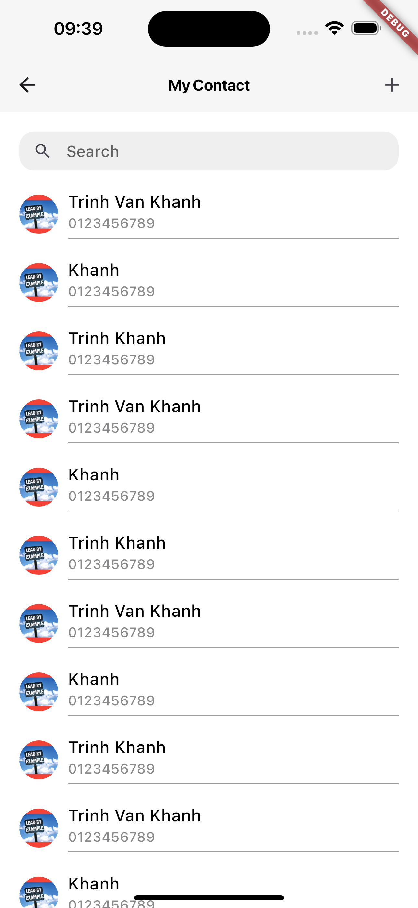

# Phần 1: Lý thuyết

Hiểu về các loại Widget và cách xây dựng Layout.

### 1. StatelessWidget và StatefulWidget

- StatelessWidget: là một Widget tĩnh (immutable widget), không thể thay đổi trạng thái sau khi `Render`; hay còn gọi là Widget không thể thay đổi trạng thái.
- StatelessWidget có 1 hàm `Widget build(BuildContext context)` để render dữ liệu lên màn hình. Hàm `build` chỉ được gọi 1 lần khi ứng dụng đang hoạt động, do vậy dữ liệu chỉ được render 1 và không thay đổi suốt quá trình sử dụng ứng dụng.
- Trường hợp nên sử dụng: Hiển thị các dữ liệu tĩnh (Appbar, Title...) hoặc sử dụng trong StatefullWidget trong một số trường hợp cần thay đổi trạng thái.
- StatefulWidget: ngược lại so với StatelessWidget, là Widget động (unimmutable widget), có thể thay đổi trạng thái.
- StatefulWidget có `hàm State<StatefulWidget> createState()` để cung cấp State cho StatefulWidget.
- StatefulWidget cung cấp phương thức `setState()` để bạn có thể thay đổi `State` của class.

#### Note:

- Nên sử dụng StatefulWidget trong một số trường hợp như thành phần con của `ListView` nhằm tránh render lại cả `ListView`.
- Nên cân nhắc lựa chọn sử dụng giữa hai Widget để cải thiện vấn đề về hiệu suất.

### 2. Các Widget cơ bản:

`Text`, `Image`, `Container`, `Column`, `Row`, `ListView`, `GridView`.

- #### ListView
  ListView widget có Layout tương tự `Column`, có khả năng cuộn khi nội dung quá dài so với render box; có thể tuỳ chỉnh theo chiều dọc hoặc chiều ngang.
- #### GridView
  GridView sắp xếp các widget dưới dạng danh sách hai chiều. GridView cung cấp hai danh sách tạo sẵn và có thể tạo lưới tùy chỉnh; tương tự ListView, GridView có khả năng tự động cuộn khi nội dung vượt quá render box.

### 3. Layout

`Stack`, `Padding`, `Margin`, `Align`.

### 4. Flutter Inspector

Flutter Inspector là công cụ trong Flutter DevTools, cho phép xem trực tiếp cây widget của ứng dụng, các thuộc tính và trạng thái của widget; các chức năng cơ bản bao gồm:

- Tìm kiếm Widget
- Kiểm tra lỗi
- Chỉnh sửa thuộc tính widget
- Hỗ trợ Hot reload

# Phần 2: Thực hành

Ứng dụng giao diện danh bạ cơ bản.

